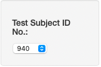
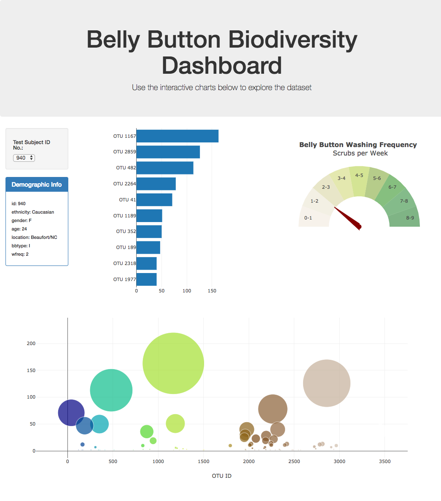

## Interactive Dashboard from the Belly Button Biodveristy dataset

Data from the [Belly Button Biodiversity dataset](http://robdunnlab.com/projects/belly-button-biodiversity/), which catalogs the microbes that colonize human navels, was used to build an interactive dashboard. 

The dataset reveals that a small handful of microbial species (also called operational taxonomic units, or OTUs, in the study) were present in more than 70% of people, while the rest were relatively rare.

## Technolgies used:

* JavaScript
* HTML/CSS
* Plotly
* S3 AWS

## Site Description

1. When first accessed, the site populates the charts and demographic info panel with the data from the first test subject in the sample, identified by test subject ID.  
2. A dropdown list of test subject IDs is located on the left side of the screen. When a user selects a test subject, the charts will dynamically change, using the data for the selected subject ID. 

3.  A demographics panel is located below the drop down list and displays some basic demographic metadata information about the selected test subject.

4. Two dynamic charts are shown on the dashboard.  The first is a horizontal bar chart that shows the top ten OTUs for the selecrted test subject.

The other chart is a bubble chart that shows the OTU's for the selected test subject.

5. The completed dashboard taken together looks like this.

- - -

## References

Hulcr, J. et al. (2012) _A Jungle in There: Bacteria in Belly Buttons are Highly Diverse, but Predictable_. Retrieved from: [http://robdunnlab.com/projects/belly-button-biodiversity/results-and-data/](http://robdunnlab.com/projects/belly-button-biodiversity/results-and-data/)
