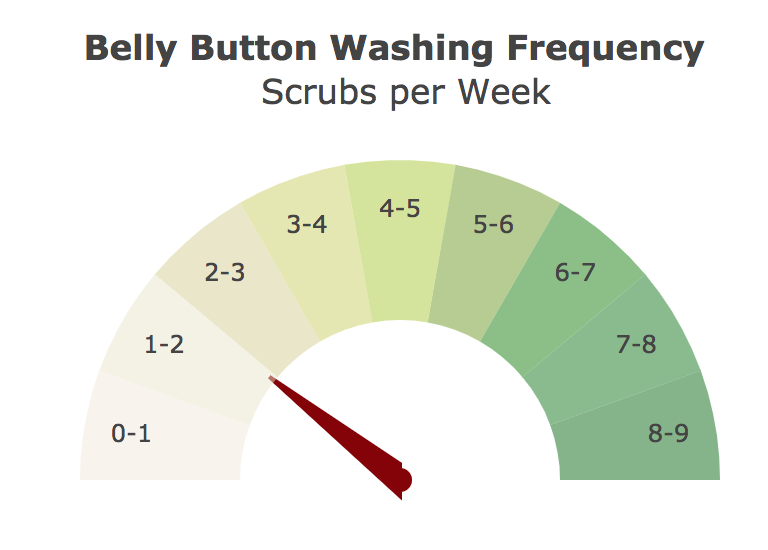

## Belly Button Biodiversity Assignment

In this assignment, data from the [Belly Button Biodiversity dataset](http://robdunnlab.com/projects/belly-button-biodiversity/), which catalogs the microbes that colonize human navels, was used to build an interactive dashboard. 

The dataset reveals that a small handful of microbial species (also called operational taxonomic units, or OTUs, in the study) were present in more than 70% of people, while the rest were relatively rare.

## Technolgies used:

* JavaScript
* HTML/CSS
* Plotly

## Site Description

1. When first accessed, the site populates the charts and demographic info panel with the data from the first test subject in the sample, identified by Test Subject ID.  
2. A dropdown list of test subject IDs is located on the left side of the screen. When a user selects a test subject, the charts will dynamically change, using the data for the selected subject ID. 

  

3. Create a bubble chart that displays each sample.

  * Use `otu_ids` for the x values.

  * Use `sample_values` for the y values.

  * Use `sample_values` for the marker size.

  * Use `otu_ids` for the marker colors.

  * Use `otu_labels` for the text values.

4. Display the sample metadata, i.e., an individual's demographic information.

5. Display each key-value pair from the metadata JSON object somewhere on the page.

6. Update all the plots when a new sample is selected. Additionally, you are welcome to create any layout that you would like for your dashboard. An example dashboard is shown below:

7. Deploy your app to a free static page hosting service, such as GitHub Pages. Submit the links to your deployment and your GitHub repo. Ensure that your repository has regular commits and a thorough README.md file

## Advanced Challenge Assignment (Optional)

The following task is advanced and therefore optional.

* Adapt the Gauge Chart from <https://plot.ly/javascript/gauge-charts/> to plot the weekly washing frequency of the individual.

* You will need to modify the example gauge code to account for values ranging from 0 through 9.

* Update the chart whenever a new sample is selected.

## Hints

* Use `console.log` inside of your JavaScript code to see what your data looks like at each step.

* Refer to the [Plotly.js documentation](https://plot.ly/javascript/) when building the plots.

## Rubric

[Unit 14 Homework Rubric](https://docs.google.com/document/d/1wD_hOEJELD2hifTaECfx66xlpEdJeYm3mL8q2Zoq1vo/edit?usp=sharing)

- - -

## References

Hulcr, J. et al. (2012) _A Jungle in There: Bacteria in Belly Buttons are Highly Diverse, but Predictable_. Retrieved from: [http://robdunnlab.com/projects/belly-button-biodiversity/results-and-data/](http://robdunnlab.com/projects/belly-button-biodiversity/results-and-data/)

- - -

© 2022 Trilogy Education Services, a 2U, Inc. brand. All Rights Reserved.
